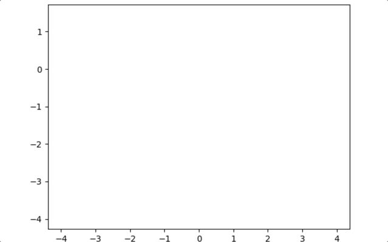

# Chaos Pendulum
A double pendulum is a mechanical system that mimics a normal pendulum but it includes two degrees of freedom. The peculiarity of this system is that the motion of the first and second pendulum is chaotic. For the pendulum, chaos is seen as a seemingly random movement that is difficult to predict. In this project, I solve for the positions of mass 1 and mass 2 given a set of variable initial conditions including the mass of each pendulum, length of each pendulum, gravity, initial angle, initial angular velocity, and time. The final output is a set of x and y positions of each mass plotted as dots on a two-dimensional plane. This is then animated to show the pathing of the masses. I also model the pathing of the pendulum when it is under the conditions of a normal mode.

[Colab Link](https://colab.research.google.com/github/IshanRayen/pendulum/blob/main/Double_Pendulum_Independent_Project.ipynb)
 
Note: Open and run in Colab to allow all animations to load. 

